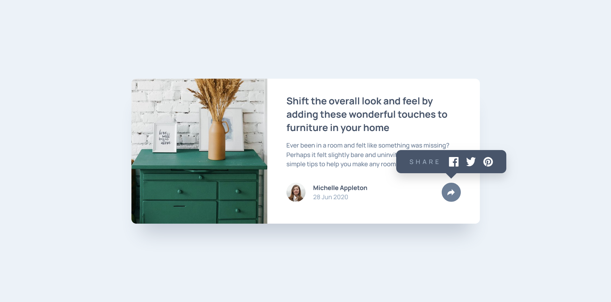
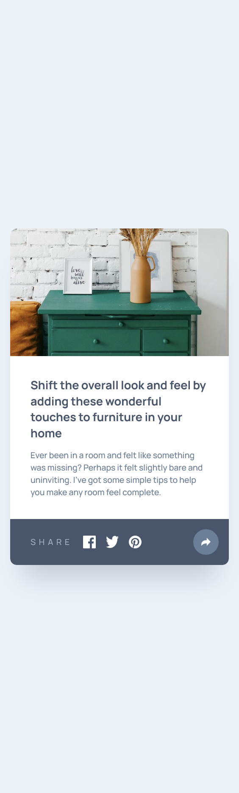

# Frontend Mentor - Article Review Component solution

This is a solution to the [Article Review/Preview Component challenge](https://www.frontendmentor.io). Frontend Mentor challenges help you improve your coding skills by building realistic projects.

## Table of contents

- [Overview](#overview)
  - [The challenge](#the-challenge)
  - [Screenshot](#screenshot)
  - [Links](#links)
- [My process](#my-process)
  - [Built with](#built-with)
  - [What I learned](#what-i-learned)
  - [Continued development](#continued-development)
  - [Useful resources](#useful-resources)
- [Features](#features)
- [Features in Detail](#features-in-detail)
- [Getting Started](#getting-started)
- [Usage](#usage)
- [Project Structure](#project-structure)
- [Author](#author)
- [Acknowledgments](#acknowledgments)

## Overview

A modern, responsive article preview/review card built with React. Features share tooltip, author meta, interactive actions, keyboard-accessible controls, and responsive layout.

### The challenge

Problem: Many article preview components lack accessible interactions and don’t adapt well to small screens.
Solution: This project implements a clean, mobile-first card with an accessible share menu, proper semantics, and polished hover/focus states.
Impact: Offers a production-friendly UI building block you can drop into blogs, magazines, or news apps.

### Screenshot





### Links

- Solution URL: [Add solution URL here](https://github.com/Frontend-Mentor-Portfolio/article_review_component)
- Live Site URL: [Add live site URL here](https://your-live-site-url.com)

---

## My process

### Overview
This component was built with a mobile-first approach, focusing on accessible interactions and clean, semantic markup.

### 1. Planning & Design

- Defined the component’s content areas: thumbnail, title, excerpt, author block, and share action.
- Mapped interaction states for hover, focus, and share menu open/close.
- Planned responsive behavior for small and large viewports.

### 2. Core Implementation

- Implemented `ArticleCard` with React functional components.
- Added share menu toggle logic and focus management.
- Styled responsive layout with CSS and custom properties.

### 3. Accessibility & UX

- Ensured keyboard navigation and visible focus states.
- Added ARIA attributes where appropriate for the share control.
- Tuned spacing, line lengths, and hover/focus transitions.

### 4. Testing & Iteration

- Verified behavior across common browsers and devices.
- Fixed edge cases for tooltip positioning and overflow.
- Linted and refined styles for consistency.

### Built with

- **React** – UI and state management
- **Vite** – Build tool and dev server
- **CSS** – Custom properties, Flexbox, mobile-first
- **HTML5** – Semantic markup

### What I learned

Refined accessible patterns for toggling popovers/tooltips and managing focus states in small, reusable components. Reinforced responsive techniques for content cards that adapt gracefully to different screen sizes.

### Continued development

Potential enhancements include adding animations for the share tooltip, integrating real share targets, and expanding the card to support multiple article types (with tags or read-time indicators).

### Useful resources

- React Documentation – react.dev – Hooks and component patterns
- Web.dev – Accessible components and focus management
- CSS Tricks – Flexbox and responsive tips
- MDN – ARIA practices and semantics

## Features

| Feature | Details |
|---|---|
| **Responsive layout** | Mobile-first design with adaptive spacing and typography |
| **Accessible controls** | Keyboard-friendly share button with focus styles |
| **Share tooltip** | Toggleable popover for sharing affordance |
| **Author block** | Avatar, author name, and publish date |
| **Polished states** | Smooth hover and focus transitions |

## Features in Detail

- **Share Tooltip:** Toggle with click or keyboard. Dismiss via re-click or focus leaving the control group.
- **Keyboard Accessibility:** Tab through actionable elements; focus styles remain visible.
- **Semantic Markup:** Headings, article/section semantics, and descriptive labels.
- **Responsive Design:** Card adapts layout and spacing at common breakpoints.

## Getting Started

1. Clone the repository
   ```bash
   git clone https://github.com/Frontend-Mentor-Portfolio/article-review-component.git
   cd article-review-component
   ```

2. Install dependencies
   ```bash
   npm install
   ```

3. Start development server
   ```bash
   npm run dev
   ```

4. Open your browser to `http://localhost:5173`

### Scripts

- `npm run dev` – Start the Vite dev server
- `npm run build` – Create an optimized production build in `dist/`
- `npm run preview` – Preview the production build locally
- `npm run lint` – Lint the project

## Usage

- Hover or focus the share icon to reveal tooltip (or click to toggle, depending on implementation).
- Navigate via keyboard to ensure focus states and interactions are accessible.

## Project Structure

```
article-review-component/
├── src/
│   ├── components/
│   │   ├── ArticleCard.jsx
│   │   └── ArticleCard.css
│   ├── assets/
│   │   └── react.svg
│   ├── App.jsx
│   ├── App.css
│   ├── ArticleApp.jsx
│   ├── index.css
│   └── main.jsx
├── index.html
├── package.json
└── README.md
```

## Author

- Frontend Mentor - [@MhistaFortune](https://www.frontendmentor.io/profile/MhistaFortune)
- Twitter/X - [@fortunate_egwu](https://www.twitter.com/fortunate_egwu)

## Acknowledgments

- Challenge concept inspired by Frontend Mentor
- Built with React and Vite

